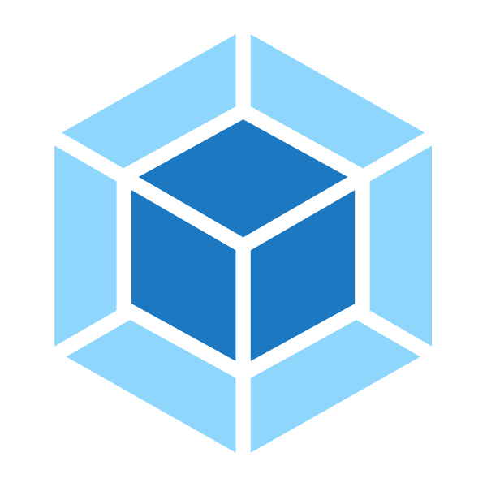

### 初次见面 👋🏻

* 我的名字是何梓煜，你也可以叫我盒子 ⚡
* 欢迎访问 ~~[我的个人网站](还在弄)~~
* 是一个大数据专业菜鸟 🐣 对计算机充满热情 💞️
* 就读于 ~~**广东第一专科学院**~~ 😄 岭南师范学院的计算机与智能教育学院，目前是一名大二在读生 👀
* 兴趣：`Random("写BUG", "玩游戏", "看动漫", "看书")` 🌱
* **共产主义** **☭** 接班人
* 期待与你相识 📫

### Hi there! 👋🏻

* This is **`Hezariah`** ✨ You can also call me **`Box`** 🐣
* I like `Random("creating bug", "playing games", "watching bangumi", "reading books")` 💞️
* **Communism** **☭** successor
* Looking forward to becoming friends with you 🤟🏻

### Stats 💯

<a href="https://reactjs.org/"><code></code></a>
<a href="https://www.typescriptlang.org/"><code></code></a>
<a href="https://www.electronjs.org/l"><code></code></a>
<a href="https://www.rust-lang.org/"><code></code></a>
<a href="https://tauri.app/"><code></code></a>
<a href="https://lesscss.org/"><code></code></a>
<a href="https://webpack.js.org/"><code></code></a>
<a href="https://vitejs.dev/"><code></code></a>

<!---
YXYHezariah/YXYHezariah is a ✨ special ✨ repository because its `README.md` (this file) appears on your GitHub profile.
You can click the Preview link to take a look at your changes.
--->
